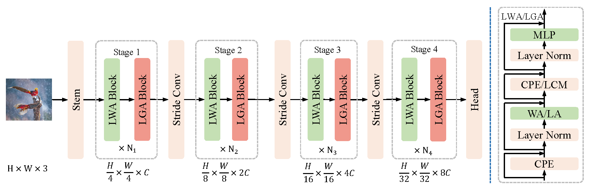

# The Linear Attention Resurrection in Vision Transformer

This repository is the official PyTorch implementation of **L<sup>2</sup>ViT** from the paper:

The Linear Attention Resurrection in Vision Transformer

## Introduction
L<sup>2</sup>ViT (**L**inear global attention and **L**ocal window attention **Vi**sion 
**T**ransformer) integrates the enhanced linear attention and local window 
self-attention in an alternatively sequential way as following:

The local window self-attention introduces locality and translational 
invariance that have been proven beneficial for vision tasks, making L<sup>2</sup>ViT 
better at modeling fine-grained and short-distance representations. 
Instead, linear global attention maintains long-range dependency and 
constructs a global context-rich representation from the whole image, 
providing a large effective receptive field. The alternative design mixes 
these complementary feature information and provides powerful modeling capacity 
with only **linear complexity**.

## Results and Pre-trained Models
### ImageNet-1K trained models

|        name        | resolution | acc@1 | #params | FLOPs | model |
|:------------------:|:---:|:-----:|:-------:|:-----:|:---:|
| L<sup>2</sup>ViT-T | 224x224 | 83.1  |   29M   | 4.7G  | [model](https://dl.fbaipublicfiles.com/convnext/convnext_tiny_1k_224_ema.pth) |
| L<sup>2</sup>ViT-S | 224x224 | 84.1  |   50M   | 9.0G  | [model](https://dl.fbaipublicfiles.com/convnext/convnext_small_1k_224_ema.pth) |
| L<sup>2</sup>ViT-B | 224x224 | 84.4  |   89M   | 15.9G | [model](https://dl.fbaipublicfiles.com/convnext/convnext_base_1k_224_ema.pth) |

### ImageNet-22K trained models

| name | resolution | acc@1 | #params | FLOPs | 22k model | 1k model |
|:---:|:---:|:-----:|:---:|:-----:| :---:|:---:|
| L<sup>2</sup>ViT-B | 224x224 | 86.0  | 89M | 15.9G | [model](https://dl.fbaipublicfiles.com/convnext/convnext_base_22k_224.pth)   | [model](https://dl.fbaipublicfiles.com/convnext/convnext_base_22k_1k_224.pth)
| L<sup>2</sup>ViT-B | 384x384 | 87.0  | 89M | 47.5G |     -          | [model](https://dl.fbaipublicfiles.com/convnext/convnext_base_22k_1k_384.pth)

## Usage
### Installation
```bash
pip install -r ./classification/requirements.txt
```

### Dataset Preparation

Download the [ImageNet-1K](http://image-net.org/) classification dataset and structure the data as follows:
```
/path/to/imagenet-1k/
  train/
    class1/
      img1.jpeg
    class2/
      img2.jpeg
  val/
    class1/
      img3.jpeg
    class2/
      img4.jpeg
```

## Evaluation
L<sup>2</sup>ViT-B pre-trained on ImageNet-1K:

Single-GPU
```bash
python main.py --model L2ViT_Base --eval true \
--resume /path/to/pre-trained-checkpoint --input_size 224 \
--data_path /path/to/imagenet-1k --output_dir output_dir
```
Multi-GPU
```bash
python -m torch.distributed.launch --nproc_per_node=8 main.py \
--model L2ViT_Base --eval true \
--resume /path/to/pre-trained-checkpoint --input_size 224 \
--data_path /path/to/imagenet-1k --output_dir output_dir
```

This should give 
```
* Acc@1 84.384 Acc@5 96.902 loss 0.802
```

## Training
All models use multi-GPU setting with a total batch size of 4096 on ImageNet-1k and 1024 on ImageNet-22k.

<details>
<summary>
Training from scratch on ImageNet-1k.
</summary>

```bash
python -m torch.distributed.launch --nproc_per_node=8 main.py \
     --model L2ViT_Base --drop_path 0.3 --layer_scale_init_value 0 --batch_size 128 \
     --lr 4e-3 --update_freq 4 --epochs 300 --save_ckpt_freq=100 --use_amp=false \
     --model_ema true --model_ema_eval true --data_path /path/to/imagenet-1k \
     --output_dir output_dir
```
</details>

<details>
<summary>
Training from scratch on ImageNet-22k.
</summary>

```bash
python -m torch.distributed.launch --nproc_per_node=8 main.py \
    --drop_path 0.2 --warmup_epochs 5 --weight_decay 0.05 --min_lr 1e-5 --warmup_lr 1e-6 \
    --layer_scale_init_value 0 --batch_size 128 --lr 1e-3 --update_freq 1 --epochs 90 \
    --save_ckpt_freq=10 --use_amp=false --evaluate_freq=10 --data_set=IMNET22k \
    --data_path=/path/to/image-22k --output_dir output_dir"
```
</details>

<details>
<summary>
Fine-tune from ImageNet-22K pre-training (224x224)
</summary>

```bash
python -m torch.distributed.launch --nproc_per_node=8 main.py \
    --drop_path 0.2 --warmup_epochs 5 --weight_decay 1e-8 --min_lr 4e-7 --warmup_lr 4e-8 \
    --layer_scale_init_value 0 --batch_size 64 --lr 4e-5 --update_freq 2 --save_ckpt_freq=10 \
    --epochs 30 --use_amp=false --model_ema true --model_ema_eval true \
    --data_path /path/to/iamgenet-1k --finetune /path/to/pre-trained-model \
    --output_dir output_dir
```
</details>

<details>
<summary>
Fine-tune from ImageNet-22K pre-training (384x384)
</summary>

```bash
python -m torch.distributed.launch --nproc_per_node=8 main.py \
    --input_size 384 --drop_path 0.2 --warmup_epochs 5 --weight_decay 1e-8 --min_lr 4e-7 \
    --warmup_lr 4e-8 --layer_scale_init_value 0 --batch_size 64 --lr 4e-5 --update_freq 2 \
    --save_ckpt_freq=10 --epochs 30 --use_amp=false --model_ema true --model_ema_eval true \
    --data_path /path/to/iamgenet-1k --finetune /path/to/pre-trained-model \
    --output_dir output_dir
```
</details>

**Note:** our ImageNet-22k dataset organization is different from other repository such as 
ConvNeXt, different ImageNet-22k organization causes different category mapping of 22k to 1k. 
And our code use the custom mapping in our repository by default.
So

* If you train from scratch on ImageNet-22k, you need add your own ImageNet-22k dataset
class in datasets.py. 

* If you fine-tune from your own pre-trained ImageNet-22k model, you need to change the 
mapping file in main.py to ensure the category mapping from 22k to 1k is right.

### Object detection and semantic segmentation
Follow the official OpenMMLab [mmdetection](https://github.com/open-mmlab/mmdetection) and 
[mmsegementation](https://github.com/open-mmlab/mmsegmentation) for installation.

After installation, you need copy the following files into mmdetection/mmsegmentation directory. 
1. Put ```object_detection/configs/*``` into ```path_to_mmdetection/configs/l2vit/```
2. Put ```object_detection/mmcv_custom``` into ```path_to_mmdetection```
3. Put ```object_detection/mmdet/models/backbones/*``` into ```path_to_mmdetection/mmdet/models/backbones/```,
 then add L<sup>2</sup>ViT into ```path_to_mmdetection/mmdet/models/backbones/__init__.py``` as following:
```python
...
from .l2vit import L2ViT
__all__ = [..., 'L2ViT']
```
4. Finally, load our pre-trained checkpoint for training.

The mmseg is similar to mmdet, then you can train detection and segmentation models using our L<sup>2</sup>ViT as backbone.

## Acknowledgement
Our repository is built on the [ConvNeXt](https://github.com/facebookresearch/ConvNeXt), [timm](https://github.com/rwightman/pytorch-image-models) library.
We sincerely thank the authors for the nicely organized code!
## License
This project is released under the MIT license. Please see the [LICENSE](LICENSE) file for more information.

## Citation
If you find this repository helpful, please consider citing:
```
@Article{
}
```  
